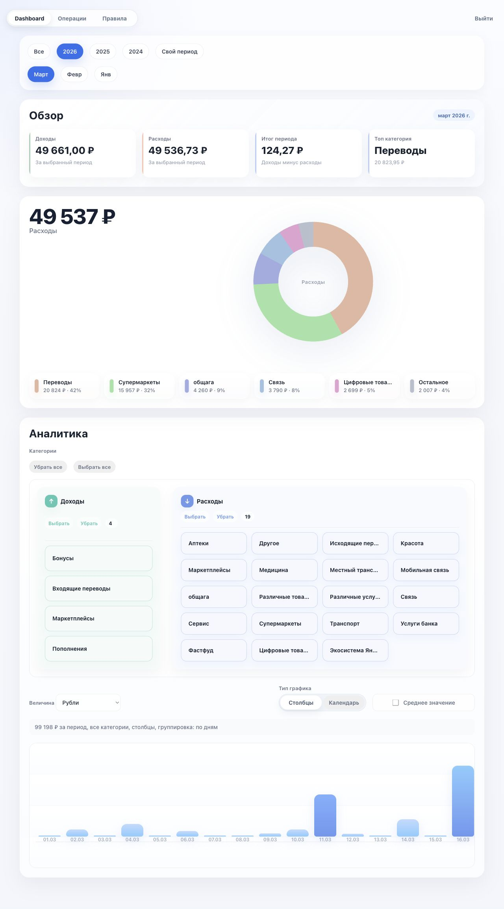
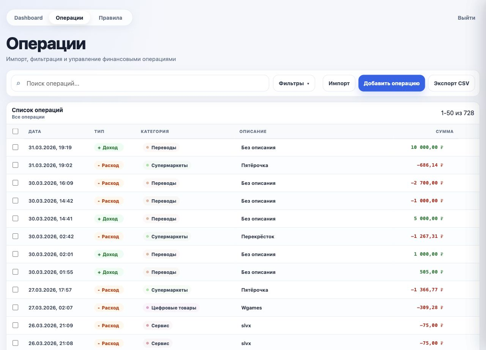
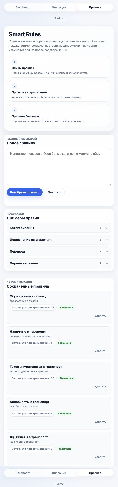

# Personal Tracker

Personal Tracker — личный финансовый трекер для импорта операций, анализа расходов и автоматизации обработки транзакций.

## Возможности

- регистрация и вход по сессии
- импорт операций из XLS/XLSX
- ручное добавление, редактирование и удаление операций
- фильтры, поиск, сортировка и экспорт CSV
- дашборд с аналитикой доходов, расходов и категорий
- Smart Rules — автоматическая обработка операций через текстовые правила

## Стек

### Бэкенд

- Java 17+
- Spring Boot 4
- Spring Web MVC
- Spring Security
- Spring Data JPA
- PostgreSQL
- Apache POI

### Фронтенд

- HTML/CSS
- JavaScript

### ИИ

- OpenAI Responses API

## Smart Rules

Текстовые правила преобразуются в структурированный формат и позволяют автоматически изменять категории и обработку операций.

Примеры:

- `Ozon в Маркетплейсы`
- `кэшбэк считать доходом`
- `не учитывать переводы между своими счетами`

## Страницы

- `/` — главная страница и регистрация
- `/login` — вход
- `/myacc` — дашборд
- `/operations` — управление операциями
- `/rules` — Smart Rules

## Скриншоты

| Главная | Дашборд |
| --- | --- |
|  |  |

| Операции | Smart Rules |
| --- | --- |
|  |  |

## Локальный запуск

```bash
git clone https://github.com/ANONIMQ4/Personal_Tracker.git
cd Personal_Tracker

cp .env.example .env

./mvnw spring-boot:run
```

Приложение будет доступно на:

[http://localhost:8080/](http://localhost:8080/)

## Сборка

```bash
./mvnw -DskipTests package
java -jar target/personal-tracker.jar
```
